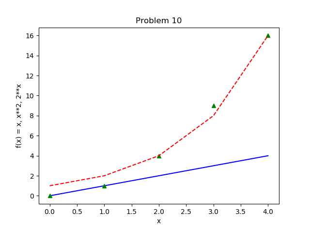

# pands-problem-set

This repository contains my solutions to the 2019 Problem Set for the Programming and Scripting at GMIT.

[See instructions here](https://github.com/ianmcloughlin/problems-pands-2019/raw/master/problems.pdf)

## How to download this repository

1. Go to [GitHub](https://github.com/AdrianDonohoe/pands-problem-set)  

2. Click the download button.

## File contents

1. solution-1.py

This is my solution to problem 1 for the Programing and Scripting problem set for 2019.

Usage:
λ python solution-1.py
Please enter a positive integer: 10
Sum of all numbers between 1 and  10  is :  55

The program can detect if you incorrectly entered a negative number, a non-numeric string and numbers larger than 20,000,000. Large numbers hung my laptop, so I added this functionality.

2. solution-2.py

This is my solution to problem 2 for the Programing and Scripting problem set for 2019.

Usage:
λ python solution-2.py

This program tells you if today begins with a 'T' or not.

3. solution-3.py

This is my solution to problem 3 for the Programing and Scripting problem set for 2019.

Usage:
λ python solution-3.py

This program prints all numbers between 1,000 and 10,000 that are divisible by 6 but not 12.

4. solution-4.py

This is my solution to problem 4 for the Programing and Scripting problem set for 2019.

Usage:
λ python solution-4.py

Asks the user to input any positive integer and outputs the successive values of the following calculation performed on it up to and including when the value becomes 1. The calculation is: if the number is even, divide it by two, if it is odd then multiply it by three and add one.

5. solution-5.py

This is my solution to problem 5 for the Programing and Scripting problem set for 2019.

Usage:
λ python solution-5.py

Asks the user to input a positive integer and tells the user whether or not the number is a prime.

6. solution-6.py

This is my solution to problem 6 for the Programing and Scripting problem set for 2019.

Usage:
λ python solution-6.py

Asks the user to input string and outputs every second word.

7. solution-7.py

This is my solution to problem 7 for the Programing and Scripting problem set for 2019.

Usage:
λ python solution-7.py

Asks the user to enter a positive floating point number as input and outputs
an approximation of its square root.

8. solution-8.py

This is my solution to problem 8 for the Programing and Scripting problem set for 2019.

Usage:
λ python solution-8.py

A program that outputs today’s date and time in the format “Monday, January
10th 2019 at 1:15pm”.

9. solution-9.py and moby-dick.txt/numbers.txt (used for testing output)

This is my solution to problem 9 for the Programing and Scripting problem set for 2019.

Usage:
λ python solution-9.py moby-dick.txt
or
λ python solution-9.py numbers.txt

A program that reads in a text file and outputs every second line. The program
should take the filename from an argument on the command line.

10. solution-10.py and plots.png (the plots when I ran the code)

This is my solution to problem 10 for the Programing and Scripting problem set for 2019.

Usage:
λ python solution-10.py

A program that displays a plot of the functions x, x**2  and 2x in the range [0, 4].

And finally, if you have made it this far, I really enjoyed the module. Thanks  :thumbsup: